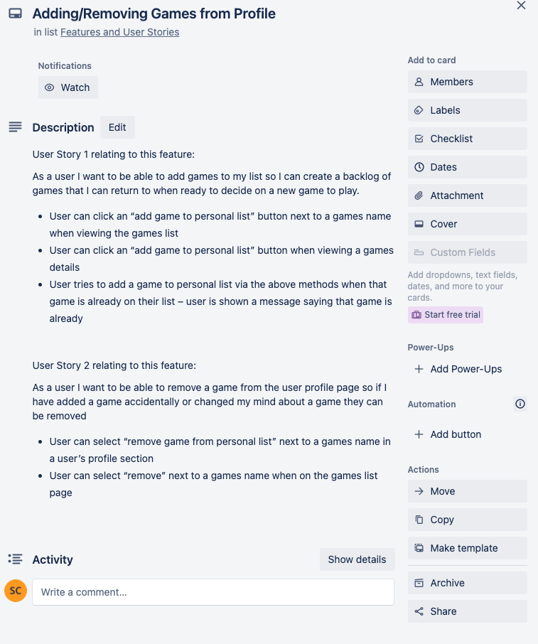

# T3A2-B Full Stack App (Part B)

## R10 - BackloGGo Deployed Site

### [BackloGGo](https://t3a2-b-frontend-production.up.railway.app/)

## R11 GitHub Respo - Part B

### [GitHub Respo](https://github.com/s-carter91/T3A2-B)

## R12 - Part A Documentation

### T3A2-A - Full Stack App (Part A)

### Kwong Fei Alvin Lai & Sam Carter

## [Github Repository Link](https://github.com/s-carter91/SamCarter_T3A2)

## R1 - Description of the Website

### Purpose

BackloGGo is a full stack application with the purpose of helping end users find and document what games they may want to play. Gaming has grown to such a large scale that it’s impossible to play or even know every game out there. This app aims to help users by allowing them to search through a catalogue and discover games they may not know existed and add them into a “to play” list. When gamers grow up, the excitement to game is still there but, as life goes on, the time can be lacking. Having the ability to store a backlog of games in one place can really help gamers select the right game to play when they do find time to revisit their hobby.  
  
Individual platforms such as Sony, Steam, Epic Games, Uplay, Gog, Xbox, Nintendo along with many other gaming stores/platforms have their own wish list features but the games often vanish from a list once a game is purchased. Storing all games in the one app to view a combined wish list and backlog will be a game changer to allow players to view all of their owned and wished for games in the one place.

### Functionality/Features

#### The “BackloGGo” MVP Page component

##### Homepage

* Users are able to have access to Game page and User profile.
* Trending games with ratings displayed
* Login/sign up feature if time permits will be on the homepage

##### Game catalogue page

* Users are able to view the games through different categories, such as genre of game, trending games or top-rated games.
* Search feature is implemented for users to be able to find specific games.
* Description/synopsis of game is provided

##### User profile

* Features games played
* If game is completed by user
* Rating given to game by user
* Comments on game by user

#### API Features

* Users can add games to their profile from the gaming catalogue
* Users can rate and review the game and have it stored to their profile
* Users can state if they completed the game.

### Target Audience

The target audience of the app is gamers of all shapes and sizes. It may appeal slightly more to the gamers with less time though as organisation for these users could be more important. Users who grew up with gaming as a large part of their lives can’t always continue the trend into their adult lives. For these users, where gaming sessions could be few and far between, it would be very helpful to have this app so they can check their lists when they do find time.  
  
Even for gamers with the time to play consistently, the sheer number of games that have flooded the market can be hard to keep up with. When their lists are spread out across multiple platforms and consoles, it can be very hard to keep up. Having a single list allows users to check what they want to play next while also providing a feel of achievement when games are added to a user’s completed list.

### Tech stack

* Node.JS
* HTML
* CSS
* Bootstrap
* Express.JS
* MongoDB
* React.JS
* MongoDB Atlas - Cloud based database management
* Railway- cloud based app deployment
* GitHub - source control
* Trello - Project management

## R2 - Dataflow Diagram

## R3 - Architecture Diagram

## R4 - User Stories

Below is a list of user stories and beneath each are how the User Story action focus is carried out within the application.

### As an user of the site I want to create an account so I can login

* Provide an email, name and password when creating an account
* If an email address already belongs to an account and a new account is created with the same email, the user will receive an message making them aware of this

### As an user of the site I want to an log in so I access the features on the site

* Username and Password match that of a user account in the system and end-user is taken to the homepage/profile page
* Username is wrong so credentials error is shown to end-user
* Password is wrong so credentials error is shown to end-user
* Username is left blank so end-user will be shown an error advising username box cannot be empty
* Password is left blank so end user will be shown an error advising password box cannot be empty

### As a user I want to view a list of all games so I can view or add games to my profile and play them

* User can select the “Games List” option from the sticky nav bar at the top of the page
* User can select “Games List” option from the Home Page

### As an end-user of the site I want to be able to search for a game so I can view or add specific games to my profile without having to scroll through every game

* User enters a game name into the search text box at the top of the games list and this leaves only the games 
* User enters a game name incorrectly into the search text box at the top of the games list and if no matches are found user is shown an error advising that no games exist in the database with that name
* User types in “He” and commences the search. A list of all games containing “he” (starting with or throughout) will be displayed

### As a user I want to be able to view details about a game so I can decide if I want to play the game

* User can select a game from the games list to view the game details on the game page

### As a user I want to be able to filter games using certain options (genre, platform, hours to complete, multiplayer?) so I can discover games based on my preferences

* User picks “strategy” genre from a drop-down list which displays only games belonging to this genre
* User picks “PlayStation 5” platform from a drop-down list which displays only the games available to play on the PlayStation 5
* User “10-15 hours” from a drop-down list which displays only the games that can be completed in this time frame.
* User picks “multiplayer” from a drop-down list which displays only the games that are multiplayer
* User selects a mix of options from the drop-down lists, but no games meet the filters, so user is shown a message informing them of this

### As a user I want to be able to rate a game so I can give my opinion on a game

* While user is viewing a game they can select “rate game” button at the top of the page

### As a user I want to review or comment on a game so I can give my opinion for others to see

* From the game details screen, user selects the “leave a comment/review” button to open a popup to input text.
* User tries to leave a review/comment when they already have commented on a certain game. Will be prompted to edit/update existing comment

### As a user I want to be able to view my list of games so I can decide what to play next

* User selects the “user profile” option on the Nav bar to see all games
* User can use “view my games list” button from the games list

### As a user I want to be able to add games to my list so I can create a backlog of games that I can return to when ready to decide on a new game to play

* User can click an “add game to personal list” button next to a games name when viewing the games list
* User can click an “add game to personal list” button when viewing a games details
* User tries to add a game to personal list via the above methods when that game is already on their list – user is shown a message saying that game is already

### As a user I want to be able to remove a game from the user profile page so if I have added a game accidentally or changed my mind about a game they can be removed

* User can select “remove game from personal list” next to a games name in a user’s profile section
* User can select “remove” next to a games name when on the games list page

### As a user I want to be able to mark a game as completed from my list so I know which games I have completed

* User can mark the game as completed using a “completed” button from their profile games page

### As a user I want to view games I’ve completed so I can see which games I have completed

* User can choose to view their “completed” list from their profile games page

## R5 - Wireframes

| Page Name | Desktop | Tablet | Mobile |
|-----------|---------|--------|--------|
| Home ||||
| Login ||||
| Signup ||||
| Profile ||||
| Games List ||||
| Game Details ||||

## R6 - Trello Board Screenshots

## R14 - Trello

### [Trello Board](https://trello.com/invite/b/4uKg7dRY/ATTI8a20f701ab5d8e2986e1f41499dc31a199743729/t3a2-trello)

Snapshot of Our Trello Board

## Note From the Authors

We unfortunately underestimated how long relearning React and completing the site would take so we weren't able to include any extra components outside of our MVP. This aside, working on this project has been an incredible learning experience and the knowledge I've gained in the past two weeks has been gigantic.
